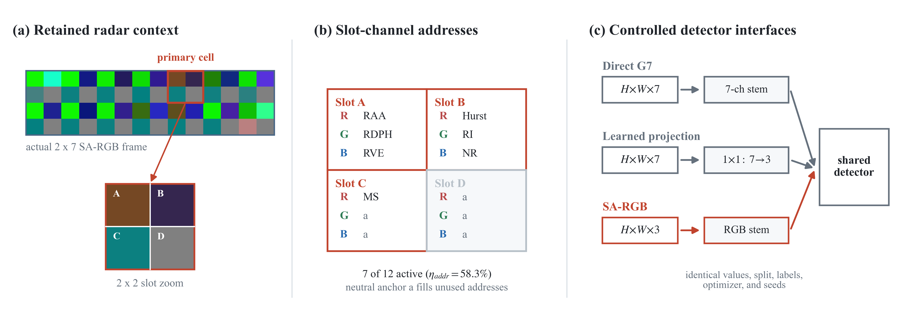
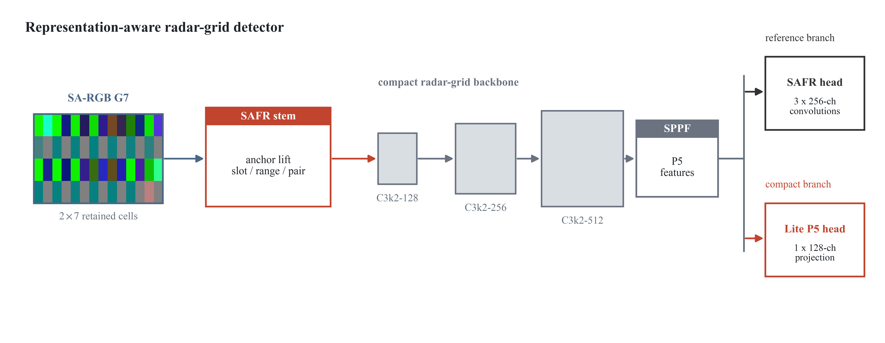

# Slot-Addressable RGB Radar Grids for Multi-Feature Encoding in Maritime Small-Target Detection

[](https://www.python.org/downloads/)
[](https://pytorch.org/)
[](https://opensource.org/licenses/MIT)
[](https://github.com/ShijiFan/SA-RGB-Maritime-Radar)

Official PyTorch implementation of **SA-RGB (Slot-Addressable RGB Radar Grids)**, **SAFR (Slot-Anchor Feature Readout)**, and the lightweight **RadarGrid-Lite (0.33M)** detector for maritime radar small-target detection in heavy sea clutter.

---

## 📖 Overview

Standard computer vision backbones assume 3-channel RGB inputs. When applying deep object detectors to maritime radar, incorporating higher-dimensional feature sets ($K > 3$) presents a dilemma:
- **Direct Multi-Channel Tensors ($C=K$)**: Require modifying first-layer convolutions, forfeiting pretrained 3-channel RGB weights.
- **Learned Linear Projections ($K \to 3$)**: Suffer from severe initialization sensitivity and optimization traps.
- **SA-RGB Formulation**: We establish a deterministic spatial-channel slot assignment within each radar macro-cell (4 sub-slots $\times$ 3 channels = 12 addressable coordinates). Features (Hurst, RAA, RDPH, RVE, RI, NR, MS) occupy fixed geometric addresses relative to a neutral anchor ($a = 128/255$).

<p align="center">
  
</p>

### Key Architecture: SAFR and RadarGrid-Lite
- **SAFR (Slot-Anchor Feature Readout)**: An anchored residual stem $\Phi(I) = [I, I-a, |I-a|]$ with three directional depthwise convolution branches (local-cell, horizontal range-neighborhood, vertical cross-cell) and channel gating.
- **RadarGrid-Lite**: A heavily pruned, single-head detector designed specifically for fixed radar-grid geometry, slashing parameters by **87.3%** (0.33M vs. 2.59M) while doubling inference speed.

<p align="center">
  
</p>

---

## ⚡ Key Results & Benchmarks

### 1. Hardware Inference Latency (NVIDIA GeForce RTX 5080, 500 Iterations, Batch=1, FP32)
*Measured model-only inference latency (excluding external STFT calculation):*

| Model | Parameters | Peak VRAM | **Median Latency** | Mean Latency | P95 Latency | **Throughput** |
|---|---|---|---|---|---|---|
| **RadarGrid-Lite** | **327,841 (~0.33M)** | 111.2 MiB | **2.68 ms** | **2.77 ms** | 3.31 ms | **373.5 FPS** |
| **SAFR** | 398,657 (~0.40M) | 111.5 MiB | **2.86 ms** | **2.99 ms** | 3.60 ms | **350.2 FPS** |
| **YOLOv11n (Baseline)** | 2,590,035 (~2.59M) | 72.0 MiB | **5.44 ms** | **5.61 ms** | 6.43 ms | **183.8 FPS** |

### 2. 15-Seed Interface Reliability Protocol (R7)
*Demonstrating deterministic slot-addressing stability vs. learned linear projection ($7 \to 3$):*

| Interface | Seeds Evaluated | Ceiling Criteria | **Ceiling Rate ($\ge 99.0\%$)** | Worst Seed | Mean $\pm$ Std |
|---|---|---|---|---|---|
| **SA-RGB (Ours)** | 15 | mAP50:95 $\ge 99.0\%$ | **13 / 15 (86.67%)** | 95.38% | **$99.18\% \pm 1.06\%$** |
| **Learned 7-to-3** | 15 | mAP50:95 $\ge 99.0\%$ | **3 / 15 (20.00%)** | 83.46% | $95.86\% \pm 4.45\%$ |
| **Statistical Test** | \multicolumn{5}{l|}{**Two-sided Fisher's Exact Test: $p = 0.00068$ ($p < 0.001$), Odds Ratio = 26.0**} |

---

## 🚀 Quick Start

### 1. Installation
```bash
git clone https://github.com/ShijiFan/SA-RGB-Maritime-Radar.git
cd SA-RGB-Maritime-Radar
pip install -r requirements.txt
```

### 2. Feature Extraction & Dataset Building
Convert raw McMaster IPIX `.mat` radar records into SA-RGB format:
```bash
python scripts/build_dataset.py \
    --source data/raw_ipix1993 \
    --output data/ipix1993_sargb_0p512 \
    --duration 0.512
```

### 3. Training
Train the compact **RadarGrid-Lite** model on the generated SA-RGB dataset:
```bash
python scripts/train.py \
    --cfg configs/radargrid_lite.yaml \
    --data data/ipix1993_sargb_0p512/data.yaml \
    --epochs 40 \
    --batch 8 \
    --imgsz 640 \
    --device 0
```
Or train the full **SAFR** architecture:
```bash
python scripts/train.py \
    --cfg configs/safr_yolo11n.yaml \
    --data data/ipix1993_sargb_0p512/data.yaml \
    --epochs 40 \
    --batch 8
```

### 4. Evaluation
Evaluate trained checkpoints on the held-out test split:
```bash
python scripts/evaluate.py \
    --weights runs/exp/weights/best.pt \
    --data data/ipix1993_sargb_0p512/data.yaml \
    --split test
```

### 5. Latency Benchmarking
Measure model-only latency on your local GPU:
```bash
python scripts/bench_latency.py \
    --model configs/radargrid_lite.yaml \
    --imgsz 640 \
    --batch 1 \
    --iters 500
```

---

## 📂 Repository Structure

```text
SA-RGB-Maritime-Radar/
├── configs/                   # Architecture configurations
│   ├── radargrid_lite.yaml    # RadarGrid-Lite 0.33M architecture
│   └── safr_yolo11n.yaml      # SAFR single-head detector
├── data/                      # Dataset documentation and download links
│   └── README.md
├── docs/figures/              # System diagrams and visual pipeline assets
├── results/                   # Reproducible numerical logs from frozen protocol sweeps
│   ├── E_latency_bench.csv    # 500-iteration hardware benchmark measurements
│   ├── R7_interface_reliability.csv # 15-seed interface reliability audit
│   └── E6_summary.csv         # Dwell duration vs sample supply tradeoff summary
├── sargb/                     # Core Python library
│   ├── __init__.py
│   ├── feature_extraction.py  # Hurst, RAA, RDPH, RVE, RI, NR, MS extraction
│   ├── multichannel_models.py # Direct-7 and learned-projection baseline wrappers
│   ├── slot_anchor_readout.py # SAFR anchored residual block & Ultralytics hook
│   └── slot_encoding.py       # Slot-addressable 8-bit RGB grid assembly
├── scripts/                   # CLI execution scripts
│   ├── bench_latency.py       # Standardized CUDA latency/throughput benchmarker
│   ├── build_dataset.py       # IPIX .mat to SA-RGB dataset generator
│   ├── evaluate.py            # Test split validation and mAP calculator
│   └── train.py               # Main model training entry point
├── LICENSE                    # MIT License
├── README.md
└── requirements.txt
```

---

## 📜 Citation

If you find this work or codebase helpful for your research, please cite:

```bibtex
@article{fan2026sargb,
  author    = {Fan, Shiji and others},
  title     = {Slot-Addressable RGB Radar Grids for Multi-Feature Encoding in Maritime Small-Target Detection},
  journal   = {IEEE Journal of Selected Topics in Applied Earth Observations and Remote Sensing},
  year      = {2026},
  note      = {Under Review}
}
```

---

## 📄 License
This project is licensed under the MIT License - see the [LICENSE](LICENSE) file for details.
